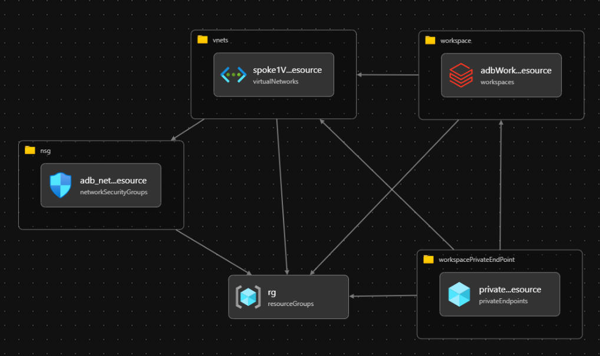

# AzureDatabricksPvtLnkDemo
Bicep files to create Azure Databricks workspace enable with Back-end Private Link, also known as data plane to control plane

# Entity relationship
Virtual Network , Networks Security grouom Azure databricks Workspace and the PrivateEndPoint are part of one Resource Group, Where in the NSG is configured on the Virtual Network. Workspace is part of the VNet as well as the Private End point which is created on the subnet of the Vnet.
`

| Name |Type |Description|
|--|--|--|
|ADB_PRVT_LNK_VNET|	Virtual network	| Vnet with 3 subnets, 2 subnets would host the Azure Databricks Clusters and one for Private Endpoint |
|databricksuldupgcah4nd2|	Azure Databricks Service|	Azure Databricks Workspace|
|{resourceGroupName}-nsg|	Network security group|	NSG for Hub|
||Workspace Endpoint| This private endpoint is a network interface that uses a private IP address from your virtual network. This network interface connects you privately and securely to a service that's powered by Azure Private Link.|

# To Do
- Install [Azure CLI](https://docs.microsoft.com/en-us/cli/azure/install-azure-cli-windows?tabs=azure-cli)
- Install [Bicep](https://docs.microsoft.com/en-us/azure/azure-resource-manager/bicep/install#azure-cli)
- Better to use VS Code with bicep extension [instructions](https://docs.microsoft.com/en-us/azure/azure-resource-manager/bicep/install#azure-cli)
- Clone the repo or download this repo, change into the repository directory using cd.

## Note

- By default location is set to West US 2 region in `main.bicep` file.
`@description('Default location of the resources')
param location string = 'westus2'`
- To create multiple environments in same subscription change the following string in main.bicep file, that would recreate all entities in a new resource group and the services will be prefixed with this string
`param prefix string = 'kkc'`

# How to use

- From the command prompt run: 
`az login`
- Recommend setting to use a specific subscription to avoid surprises:
`az account set -s "subscriptionID"
- Command to run the Bicep main deployment file, if successful that should create all the Azure Service listed in the table below.
`az deployment sub create \
    --location "westus2" \
    --template-file main.bicep 

